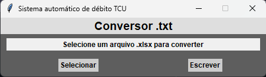

# 🚀 FastDebit


FastDebit é uma aplicação desktop desenvolvida com Tkinter para agilizar a inserção dados na [Plataforma de Gestão de Dívidas](https://divida.apps.tcu.gov.br/calculadora-debito). Basicamente, o sistema converte automaticamente os dados do arquivo Excel para o formato esperado pela plataforma, reduzindo significativamente o tempo da operação e minimizando erros de digitação.


## Objetivo
 - Reduzir tempo de inserção de dados
 - Reduzir erros de preeenchimento

---

## Tecnologias Utilizadas

- Python 3.14+
- Tkinter
- Openpyxl
- Pandas
- Programação Orientada a Objetos (POO)

---

## Funcionalidades

- Seleção de planilhas .xlsx
- Conversão dos dados
- Interface gráfica simples

---

## Estrutura

```python

app/
│
├── views/
│ └── form.py
│
├── services/
│ ├── conversion.py
│ └── file.py
│
└── main.py
```

- **Views** → Interface gráfica e eventos
- **Services** → Regras de negócio  
- **App** → Orquestração da aplicação  

Essa separação permite:

- Redução de acoplamento
- Manutenabilidade
- Possível evolução para padrões mais avançados

---

## Screenshots

> Imagem temporária
### Tela principal



## Demonstração


---

## Como executar?

### 1) Clone o repositório
```bash

git clone https://github.com/CodePhsp/projeto-fastdebit.git
cd projeto-fastdebit

```

### 2) Crie ambiente virtual
Para o sistema operacional windows

> Dica: você pode escolher qualquer nome para seu ambiente virtual
```bash
python -m venv .venv
.venv\Scripts\activate  
```

Para o sistema operacional Linux
```bash
python3 -m venv venv
source venv/bin/activate
```

### 3) Instale as dependências

```bash
python -m pip install -r requirements.txt
```

### 4) Execute
```bash
cd app
python main.py
```
